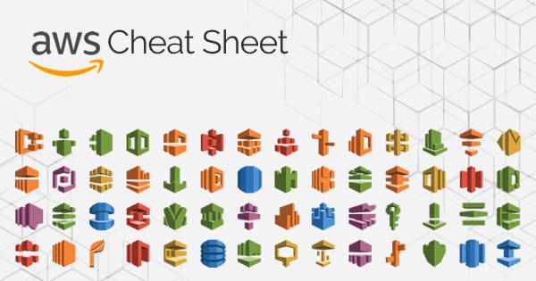

###### [Home](../../../README.md) > Amazon Web Services

> Amazon Web Services (AWS) is the world’s most comprehensive and broadly adopted cloud platform, offering over 175 fully featured services from data centers globally. 
> Millions of customers—including the fastest-growing startups, largest enterprises, and leading government agencies—are using AWS to lower costs, become more agile, and innovate faster.

## Useful Services
- S3
- EC2
- SQS
- SNS
- Lambda
- API Gateway
- VPC
- Secrets Manager

## References
- [AWS Services cheat-sheet](https://intellipaat.com/blog/tutorial/amazon-web-services-aws-tutorial/aws-cheat-sheet/)
- [AWS in a nutshell](https://www.bridge-global.com/blog/aws-in-a-nutshell/)
- [AWS Documentation] (https://aws.amazon.com/what-is-aws/)

###### [Home](../../../README.md) > Amazon Web Services
