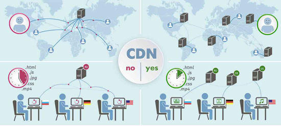

A content delivery network (CDN) refers to a geographically distributed group of servers which work together to provide fast delivery of Internet content. A CDN allows for the quick transfer of assets needed for loading Internet content including HTML pages, javascript files, stylesheets, images, and videos. 

A properly configured CDN may also help protect websites against some common malicious attacks, such as Distributed Denial of Service (DDOS) attacks.

### Benefits
- **Improving website load times** - By distributing content closer to website visitors by using a nearby CDN server (among other optimizations), visitors experience faster page loading times. As visitors are more inclined to click away from a slow-loading site, a CDN can reduce bounce rates and increase the amount of time that people spend on the site. In other words, a faster a website means more visitors will stay and stick around longer.

- **Reducing bandwidth costs** - Bandwidth consumption costs for website hosting is a primary expense for websites. Through caching and other optimizations, CDNs are able to reduce the amount of data an origin server must provide, thus reducing hosting costs for website owners.

- **Increasing content availability and redundancy** - Large amounts of traffic or hardware failures can interrupt normal website function. Thanks to their distributed nature, a CDN can handle more traffic and withstand hardware failure better than many origin servers.

- **Improving website security** - A CDN may improve security by providing DDoS mitigation, improvements to security certificates, and other optimizations.

### How does CDN work?
At its core, a CDN is a network of servers linked together with the goal of delivering 
content as quickly, cheaply, reliably, and securely as possible. In order to improve speed 
and connectivity, a CDN will place servers at the exchange points between different networks. 
These **[Internet exchange points (IXPs)](https://www.cloudflare.com/learning/cdn/glossary/internet-exchange-point-ixp/)** 
are the primary locations where different Internet providers connect in order to provide 
each other access to traffic originating on their different networks. By having a connection to these high speed and highly interconnected 
locations, a CDN provider is able to reduce costs and transit times in high speed data 
delivery.

### Push CDN

Push CDNs receive new content whenever changes occur on your server. You take full responsibility for providing content, uploading directly to the CDN and rewriting URLs to point to the CDN. You can configure when content expires and when it is updated. Content is uploaded only when it is new or changed, minimizing traffic, but maximizing storage.

Sites with a small amount of traffic or sites with content that isn't often updated work well with push CDNs. Content is placed on the CDNs once, instead of being re-pulled at regular intervals.

### Pull CDN

Pull CDNs grab new content from your server when the first user requests the content. You leave the content on your server and rewrite URLs to point to the CDN. This results in a slower request until the content is cached on the CDN.

A *time-to-live (TTL)* determines how long content is cached. Pull CDNs minimize storage space on the CDN, but can create redundant traffic if files expire and are pulled before they have actually changed.

Sites with heavy traffic work well with pull CDNs, as traffic is spread out more evenly with only recently-requested content remaining on the CDN.

### Further reading
 - [Globally distributed content delivery](https://figshare.com/articles/Globally_distributed_content_delivery/6605972)
 - [The differences between push and pull CDNs](http://www.travelblogadvice.com/technical/the-differences-between-push-and-pull-cdns/)
