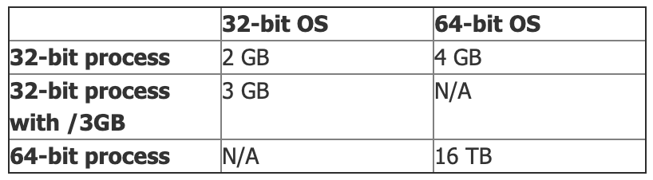

## Memory Limits for 32-bit and 64-bit processes

This really depends on a few different things.  The architecture of the process (32-bit or 64-bit) 
and also the architecture of the Operating System the process is running on. 
For 32-bit it also depends if you use the /3GB switch or not.

In a nut shell:

## Case of Windows
32-bit windows has a maximum virtual address space of 4 GB.

The OS reserves 2 GB for itself and the other 2 GB is available for user processes.

However it is possible to reconfigure this so that 3 GB is available to user processes and only 1 GB is reserved for the OS. 
To do this we need to specify the /3GB switch in your boot.ini file.

There is also a processor feature known as Physical Address Extension (PAE) which allows some
32-bit server versions of Windows to access larger amounts of physical RAM (up to 128 GB). 
However, this does not change the virtual address space which is still limited to 4 GB. 

64-bit windows has a much larger virtual address space of 8 TB. However, a 32-bit process 
running on 64-bit windows (using WOW) will still be constrained to 4 GB though the system 
can be configured so that all of this is available to a user process.
