## ATM - Requirements
The software to be designed will control a simulated automated teller machine (ATM) having a magnetic stripe reader for reading an ATM card, a customer console (keyboard and display) for interaction with the customer, a slot for depositing envelopes, a dispenser for cash (in multiples of $20), a printer for printing customer receipts, and a key-operated switch to allow an operator to start or stop the machine. The ATM will communicate with the bank's computer over an appropriate communication link.

1. The ATM will service one customer at a time. A customer will be required to insert an ATM card and enter a personal identification number (PIN) - both of which will be sent to the bank for validation as part of each transaction. The customer will then be able to perform one or more transactions.

2. Operations allowed:

    - A customer must be able to make a **cash withdrawal** from any suitable account linked to the card, in multiples of $20.00. Approval must be obtained from the bank before cash is dispensed.
    - A customer must be able to make a **deposit** to any account linked to the card, consisting of cash and/or checks in an envelope. The customer will enter the amount of the deposit into the ATM, subject to manual verification when the envelope is removed from the machine by an operator. Approval must be obtained from the bank before physically accepting the envelope.
    - A customer must be able to make a **transfer of money** between any two accounts linked to the card.
    - A customer must be able to make a **balance inquiry** of any account linked to the card.
    - A customer must be able to **abort a transaction in progress** by pressing the Cancel key instead of responding to a request from the machine.

3. The **ATM will communicate each transaction to the bank** and obtain verification that it was allowed by the bank. Ordinarily, a transaction will be considered complete by the bank once it has been approved. In the case of a deposit, a second message will be sent to the bank indicating that the customer has deposited the envelope. (If the customer fails to deposit the envelope within the timeout period, or presses cancel instead, no second message will be sent to the bank and the deposit will not be credited to the customer.)

4. If the bank determines that the customer's **PIN is invalid** the customer will be required to re-enter the PIN before a transaction can proceed. If the customer is unable to successfully enter the PIN after three tries, the card will be permanently retained by the machine, and the customer will have to contact the bank to get it back.

5. If a transaction fails for any reason other than an invalid PIN, the ATM will display an explanation of the problem, and will then ask the customer whether he/she wants to do another transaction.

6. The ATM will provide the customer with a **printed receipt** for each successful transaction, showing the date, time, machine location, type of transaction, account(s), amount, and ending and available balance(s) of the affected account ("to" account for transfers).

7. The ATM will have a key-operated switch that will allow an operator to start and stop the servicing of customers. After turning the switch to the "on" position, the operator will be required to verify and enter the total cash on hand. The machine can only be turned off when it is not servicing a customer. When the switch is moved to the "off" position, the machine will shut down, so that the operator may remove deposit envelopes and reload the machine with cash, blank receipts, etc.

8. The ATM will also maintain an internal **log of transactions** to facilitate resolving ambiguities arising from a hardware failure in the middle of a transaction. Entries will be made in the log when the ATM is started up and shut down, for each message sent to the Bank (along with the response back, if one is expected), for the dispensing of cash, and for the receiving of an envelope. Log entries may contain card numbers and dollar amounts, but for security will never contain a PIN.

## Use case diagram
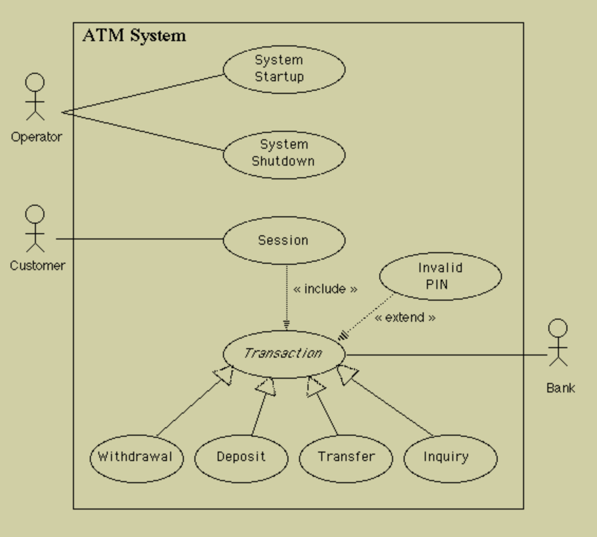

## Analysis classes
An initial reading of the use cases suggests that the following will be part of the system.

- A controller object representing the ATM itself (managing the boundary objects listed below.)
 
- Boundary objects representing the individual component parts of the ATM:
 
    - Operator panel.
    - Card reader.
    - Customer console, consisting of a display and keyboard.
    - Network connection to the bank.
    - Cash dispenser.
    - Envelope acceptor.
    - Receipt printer.

 
- Controller objects corresponding to use cases. (Note: class ATM can handle the Startup and Shutdown use cases itself, so these do not give rise to separate objects here.)
 
    - Session
    - Transaction (abstract generalization, responsible for common features, with concrete specializations responsible for type-specific portions)

 
- An entity object representing the information encoded on the ATM card inserted by customer.
 
- An entity object representing the log of transactions maintained by the machine.

## Class Diagram

> We use CRC cards to determine the required classes and their collaboration.
> **Class-responsibility-collaboration (CRC)** cards are a brainstorming tool used in the design of object-oriented software. 
> Reference: http://www.agilemodeling.com/artifacts/crcModel.htm

In addition to the classes identified at previous step, we need few more classes:

- **Message** - used to represent a message to the bank.
- **Receipt** - used to encapsulate information to be printed on a receipt.
- **Status** - used to represent return value from message to the bank.
- **Balances** - used to record balance information returned by the bank.
- **Money** - used to represent money amounts, in numerous places.
- **AccountInformation** - contains names of various types of accounts customer can choose from.

Overall class diagram:

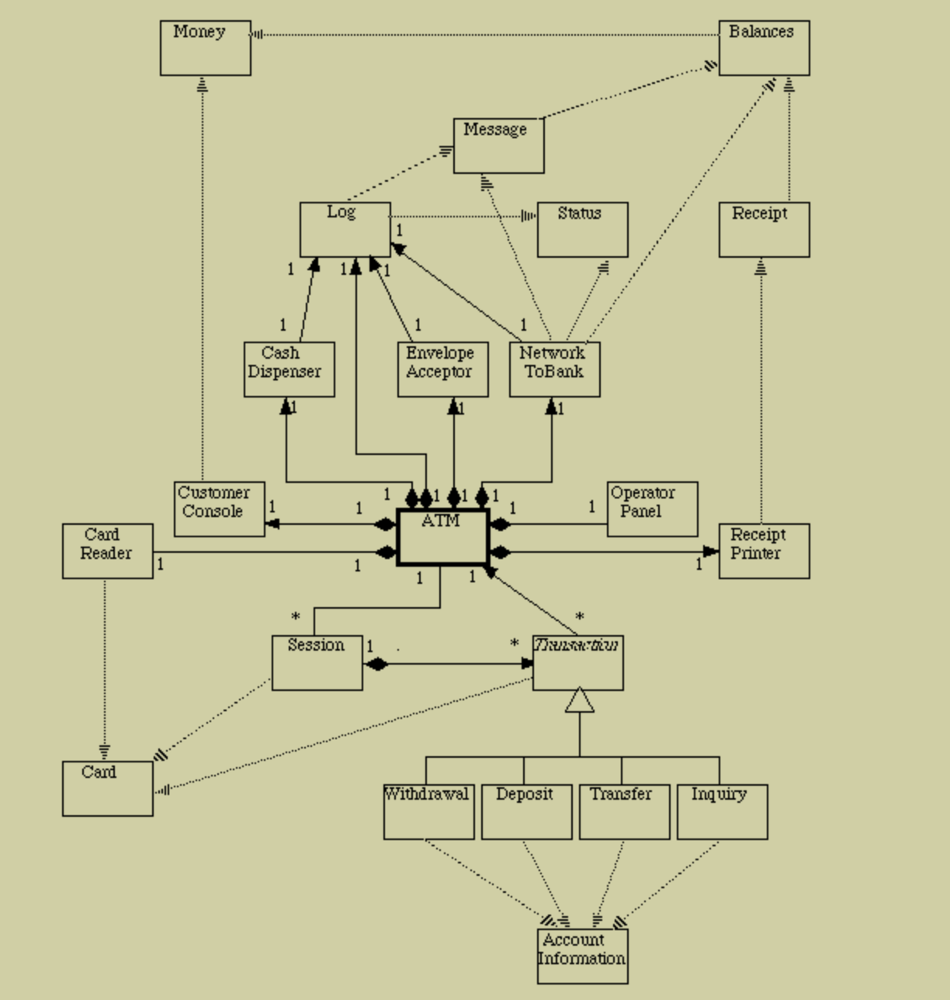

## State Chart
Three of the objects we have identified have behavior that is sufficiently complex to warrant developing a State Chart for them. (These are the objects that were identified as the major controller objects.)

- The object representing the machine itself (responsible for the System Startup and Shutdown use cases)

- Objects representing a customer session (one per session) (responsible for the Session use case)

- Objects representing an individual transaction (one per transaction) (responsible for the Transaction use case, use cases for the specific types of transaction, and Invalid PIN extension).

##### Overall ATM Setup
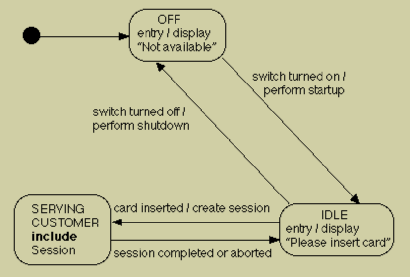

##### Customer Session

##### Customer Transaction
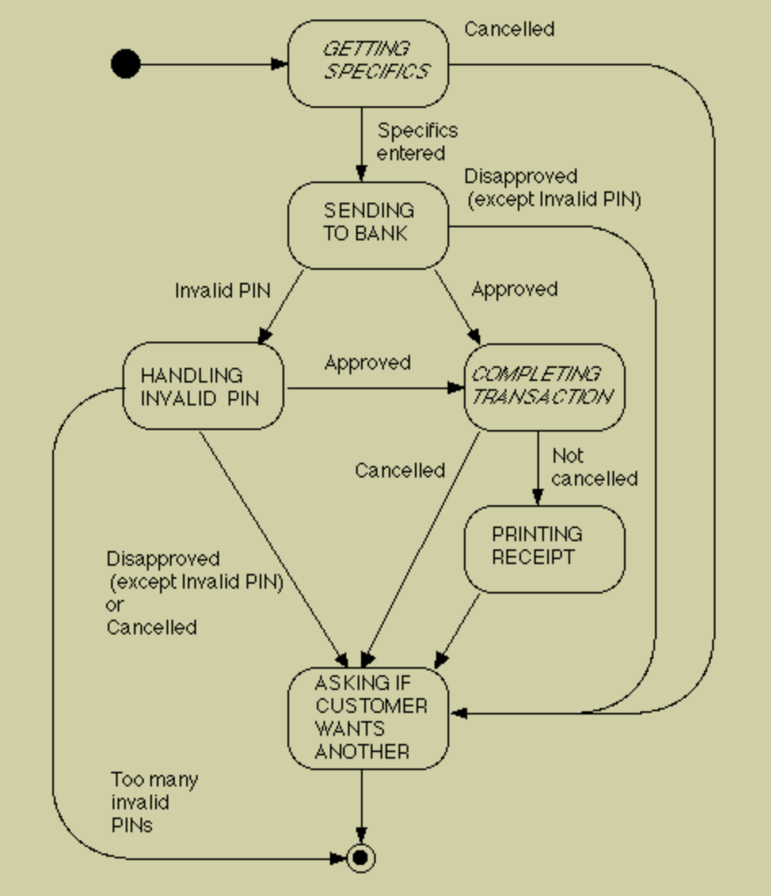

## Sequence Diagrams

##### System Startup Sequence
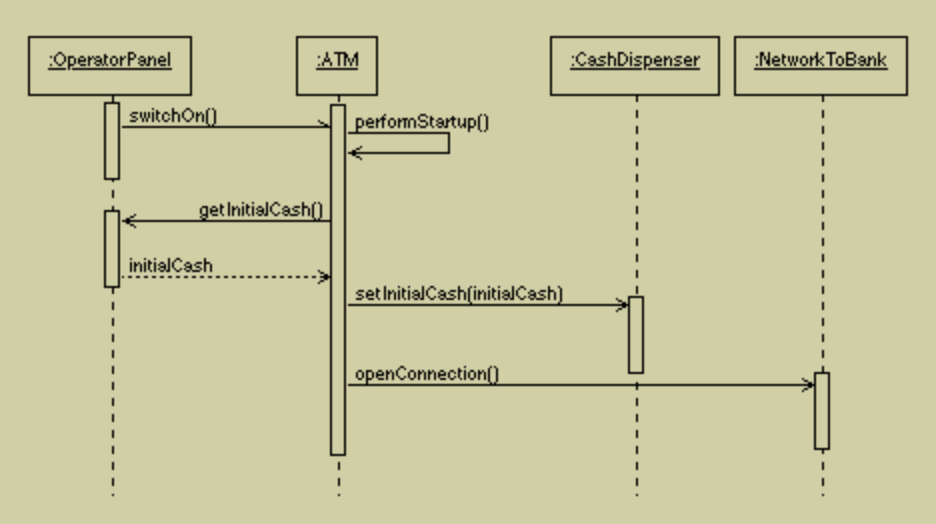

##### System shutdown Sequence
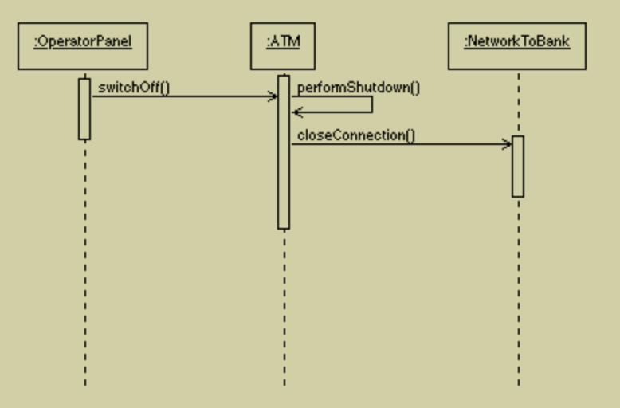

##### Customer Session Sequence
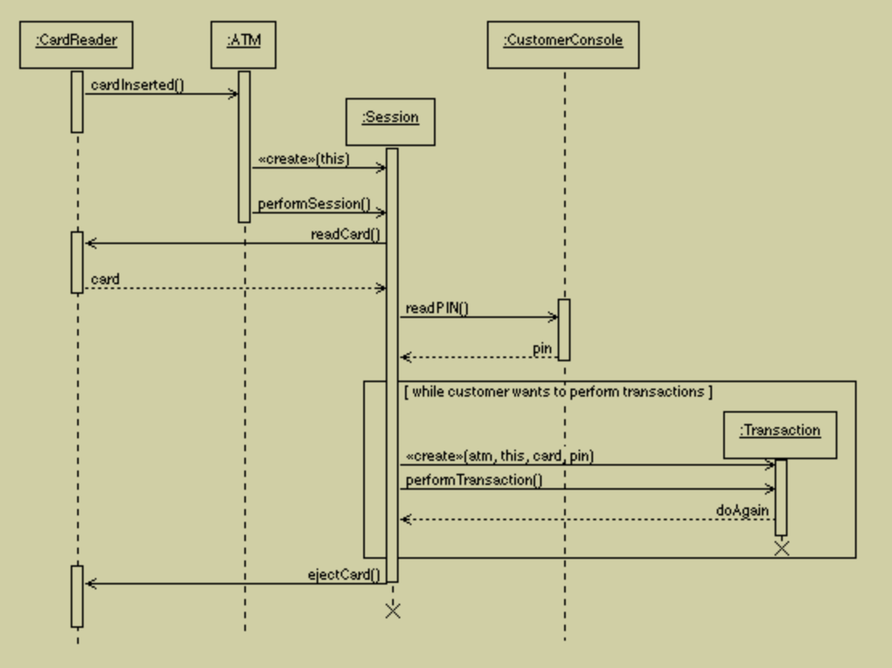

##### Transaction Sequence
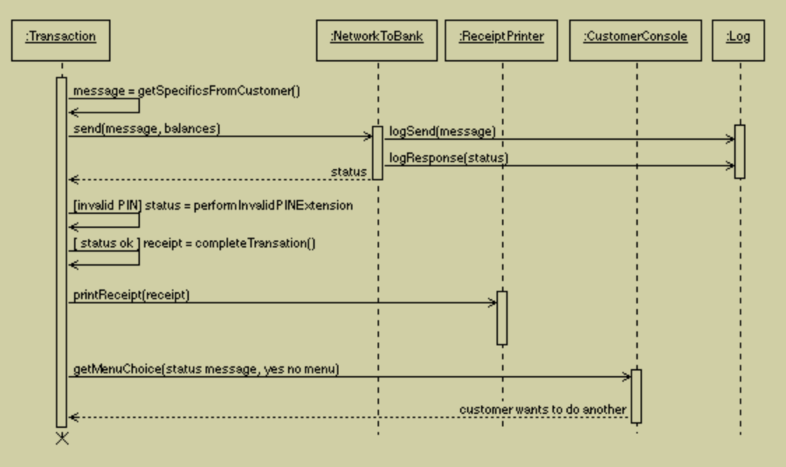

## Collaboration Diagrams
##### Withdrawal Collaborations
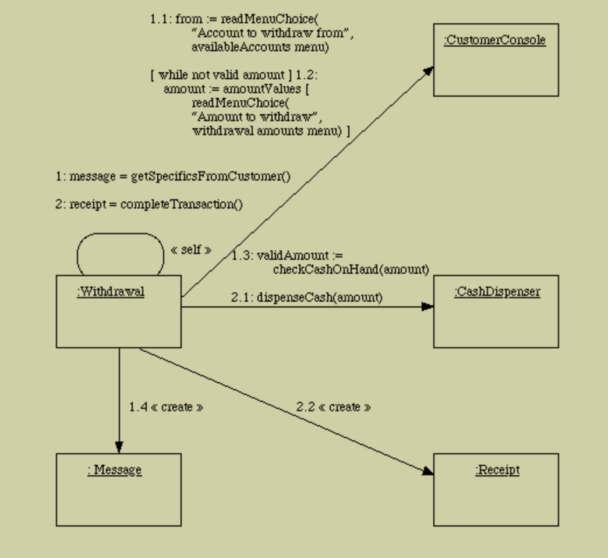

##### Deposit Collaborations

##### Transfer Collaborations
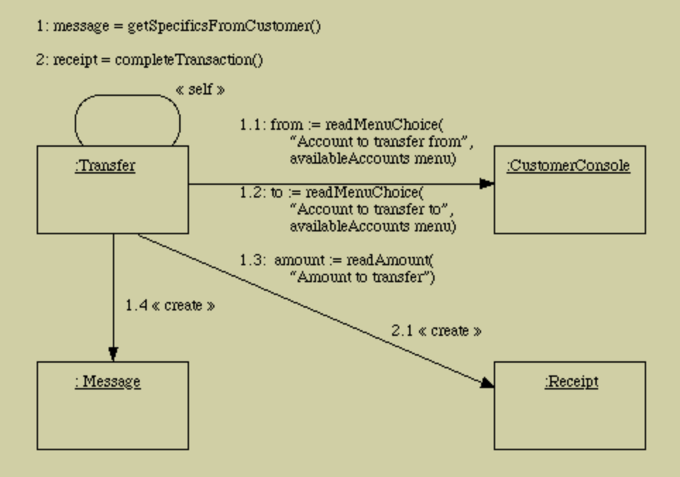

##### Enquiry Collaborations
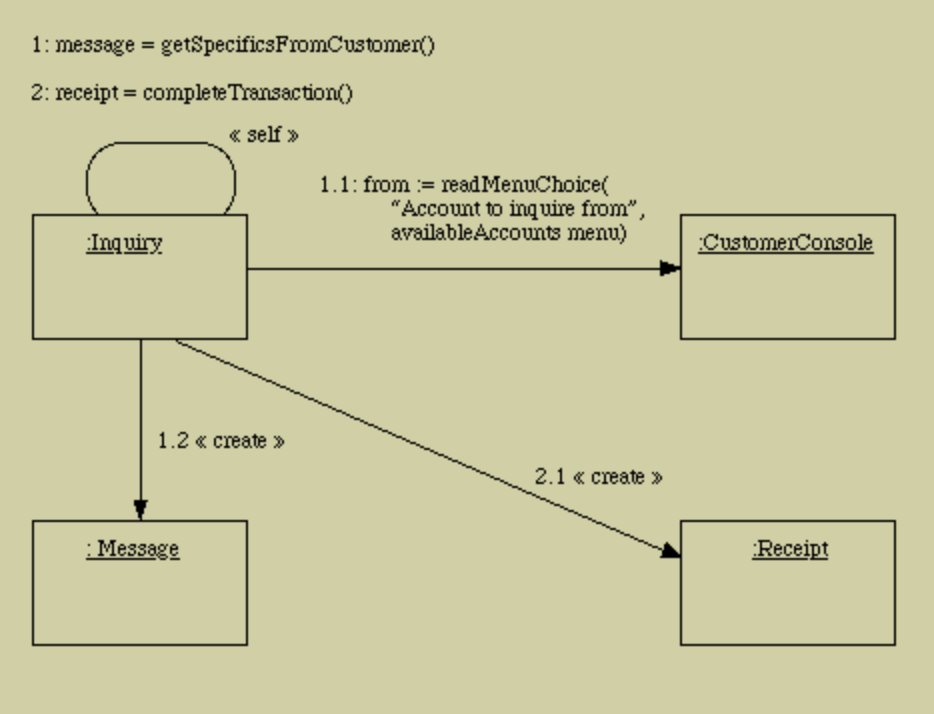

##### Invalid Pin Collaborations
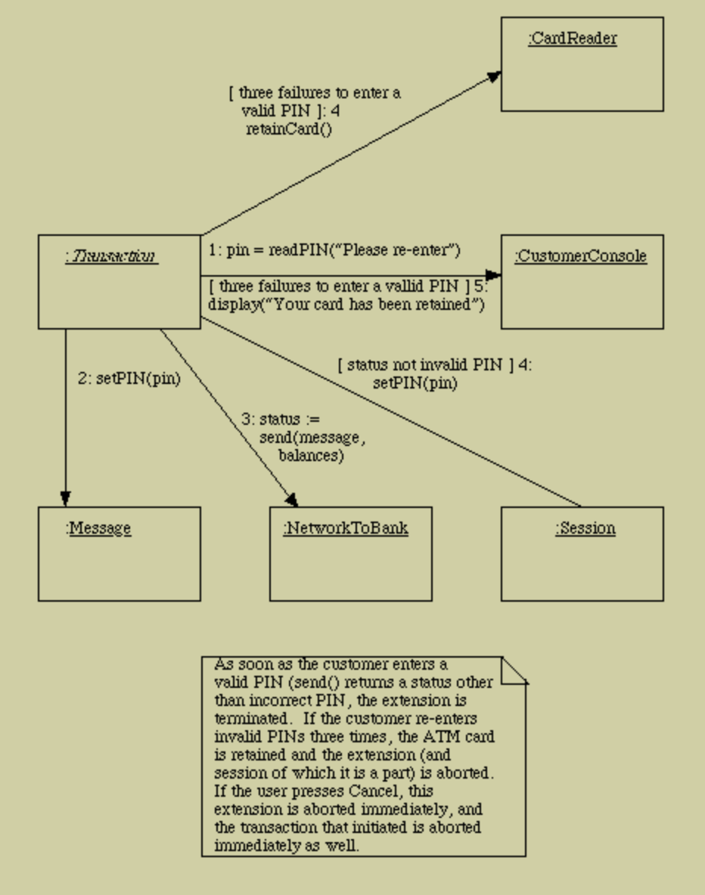

## Design Summary

In designing this system, a few key design decisions were made:

- The class **ATM** is made an active class - that is, the ATM object has its own thread. Using the Java thread facllity leads to defining a run() method in this class whose body is executed by the ATM's thread. The fact that class ATM is active is indicated in class diagrams by enclosing it in a heavier outline.
 
- Certain signals initiate computation - e.g. the signals from the operator console when the state of the switch is changed, or from the card reader when a card is inserted. In the GUI simulation of the ATM, these signals are sent by the "actionPerformed()" method of the appropriate GUI button; in a real ATM they would be sent by the physical components themselves, which might then also need to be active classes. (Note: this forms an exception to the rule that a responsibility on a CRC card translates into a method in the design - in this case the class sends a signal, rather than receiving it, so it does not need a method directly corresponding to the responsibility.)
 
- The Transaction hierarchy consists of the abstract class Transaction and four concrete subclasses (Withdrawal, Deposit, Transfer and Inquiry). The class Transaction has a "virtual constructor" called makeTransaction() which asks the customer to choose a transaction type and then constructs and returns an object of the appropriate subclass. The Transaction class is made responsible for carrying out the Transaction use case and the Invalid PIN extension; for the former, it makes use of abstract methods getSpecificsFromCustomer() and completeTransaction() which are implemented concretely by each subclass.
 
- The class Receipt is abstract. The completeTransaction() method of each kind of transaction creates a concrete instance that contains the information relevant to that kind of transaction.
 
- The class Status is abstract. The send() method of NetworkToBank constructs a concrete instance that contains the information appropriate to the response received from the bank to a particular message.

 
- Component parts of the ATM
 
    - CardReader
    - CashDispenser
    - CustomerConsole
    - EnvelopeAcceptor
    - Log
    - NetworkToBank
    - OperatorPanel
    - ReceiptPrinter

- Session
 
- The *Transaction* class hierarchy
 
    - Transaction
        - Withdrawal
        - Deposit
        - Transfer
        - Enquiry

- Classes representing banking concepts, used by the above
 
    - AccountInformation
    - Balances
    - Card
    - Message
    - Money
    - Receipt
    - Status

## Reference
http://www.cs.gordon.edu/courses/cs211/ATMExample/index.html
