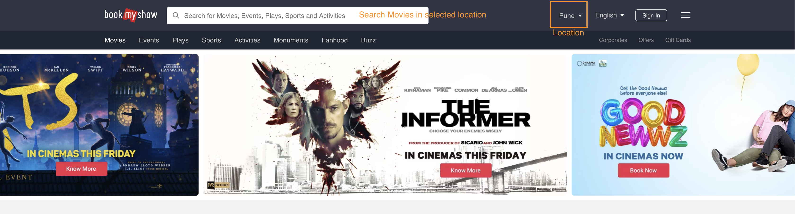
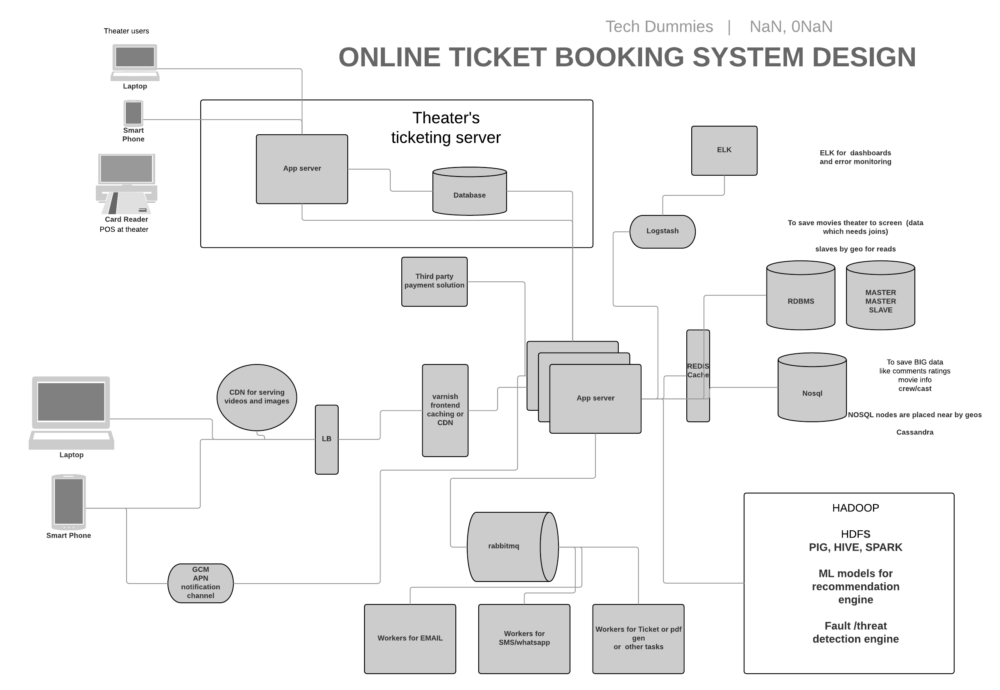
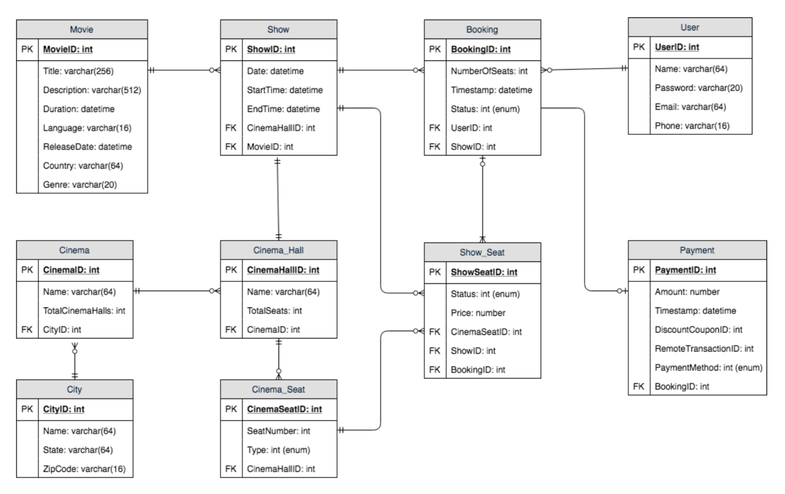

## Introduction
BookMyShow is an online ticketing solution. E- ticketing systems allow the customers to browse through movies currently 
being played and to book seats, anywhere anytime.

Other solution similar to this: ticketmaster.com

## Listing Requirements

#### Functional

To begin with, scope the solution to book movie tickets only. Later on, we can add features like booking ticket for other events.

   - Allow customers to **select a city** from **the list of all the cities** where affiliated cinemas are located.
   
   - **List all the movies** running in the cinemas of the selected city.
   
   - Allow customers to **search a specific movie**.
   
   - Once customer selects a movie, system must **display all the cinemas which are running this movie and their show times**.
   
   - System must **allow customer to select cinema -> show** in order to book the tickets.
   
   - Present user with the **seating arrangement of the auditorium** in which the selected show is running.
   
   - Customers must be provided with a **user-friendly view of available seats and already booked seats**.
   
   - Customer must be able to **select the seat(s)** of his choice and proceed for payment. System must ensure that the **selected seats are locked for 
     a period of time** i.e. 10 minutes so that the customer can make payment.
     
   - Once payment is made, **customer must be notified of relevant details** regarding the show i.e. Cinema, theater, seat and time details.
   
   - In case customer does not make payments within 10 minutes, lock on seats must be released and those seats must be considered to **serve any waiting booking request in a fair manner** using "first come first serve" policy.
   
   
#### Non-functional
    
   - Highly available and scalable system
        
   - System must be transactional in nature.
    
   - System must have a high tolerance for concurrency.
    

## Questions for Design

   - Should authentication be mandatory?
   
   - A max cap on the number of seats a user can book at a time?
   
   - Throttling requests? Say 5 booking requests per IP/User?
   
   - How elastic the system must be? 

## High level Design
Although we can do have so much more in the design, however [https://imgur.com/Ij2FqKs](https://imgur.com/Ij2FqKs) represents it at high level.

   
## Database Design

#### Designing Relational Schema

#### No SQL Preference
Cassandra to store ratings, comments and other big data for analytics

#### Full Text Search
Elastic search

## References

 - [https://www.vertabelo.com/blog/a-database-model-for-a-movie-theater-reservation-system/](https://www.vertabelo.com/blog/a-database-model-for-a-movie-theater-reservation-system/)
 
 - [https://www.linkedin.com/pulse/designing-back-end-system-bookmyshow-saral-saxena](https://www.linkedin.com/pulse/designing-back-end-system-bookmyshow-saral-saxena)
 
 - [https://leetcode.com/discuss/interview-question/124803/design-bookmyshow](https://leetcode.com/discuss/interview-question/124803/design-bookmyshow)

 - [https://www.youtube.com/watch?v=lBAwJgoO3Ek](https://www.youtube.com/watch?v=lBAwJgoO3Ek)
