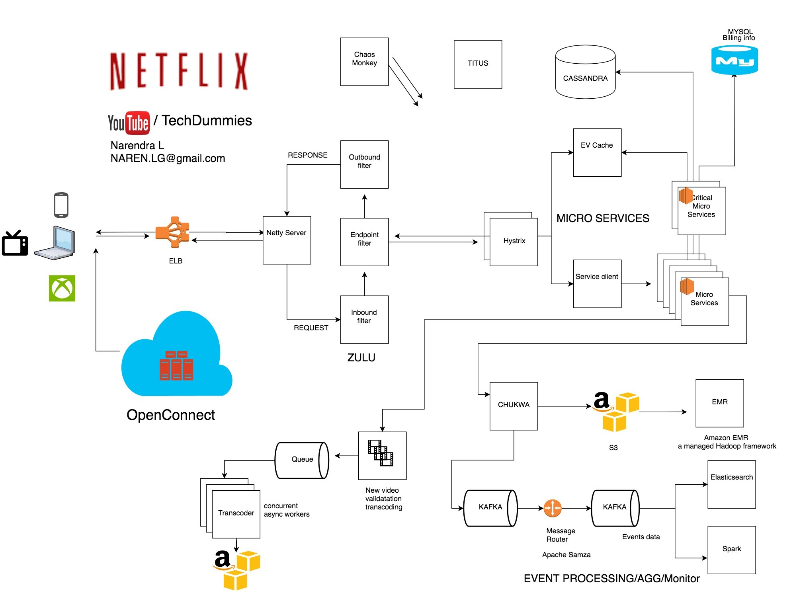

## General Architecture

## References
1. [Naren's blog](https://www.linkedin.com/pulse/system-design-netflix-narendra-l/?published=t)
2. [Naren's Youtube Channel](https://www.youtube.com/watch?v=psQzyFfsUGU)
3. [Netflix Techblog on Medium](https://www.youtube.com/redirect?v=psQzyFfsUGU&redir_token=Nz3RLGY_xSeMudVGfuwzKHSQWCt8MTU4NTExMjIzM0AxNTg1MDI1ODMz&event=video_description&q=https%3A%2F%2Fmedium.com%2Fnetflix-techblog%2Fscaling-time-series-data-storage-part-i-ec2b6d44ba39)
4. [Netflix hysterix](https://www.youtube.com/redirect?v=psQzyFfsUGU&redir_token=Nz3RLGY_xSeMudVGfuwzKHSQWCt8MTU4NTExMjIzM0AxNTg1MDI1ODMz&event=video_description&q=https%3A%2F%2Fgithub.com%2FNetflix%2FHystrix)
5. [Netflix EVCache](https://www.youtube.com/redirect?v=psQzyFfsUGU&redir_token=Nz3RLGY_xSeMudVGfuwzKHSQWCt8MTU4NTExMjIzM0AxNTg1MDI1ODMz&event=video_description&q=https%3A%2F%2Fgithub.com%2FNetflix%2FEVCache)
