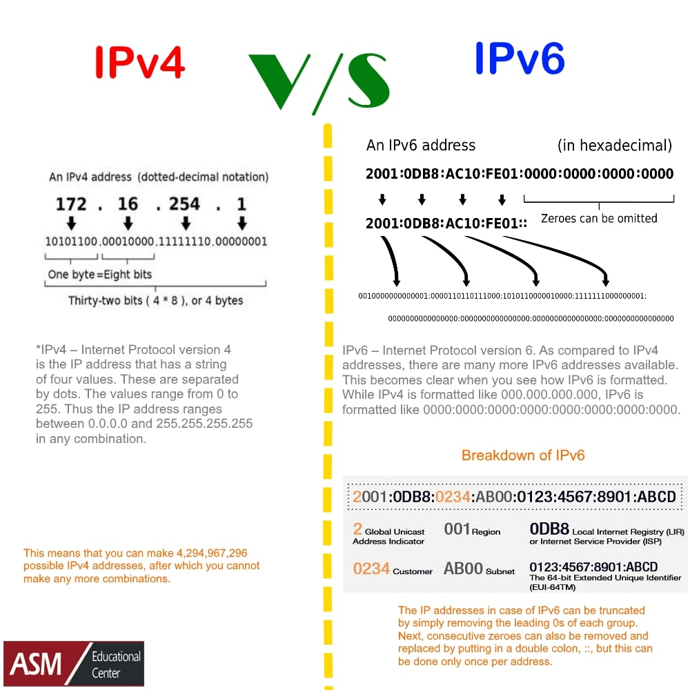
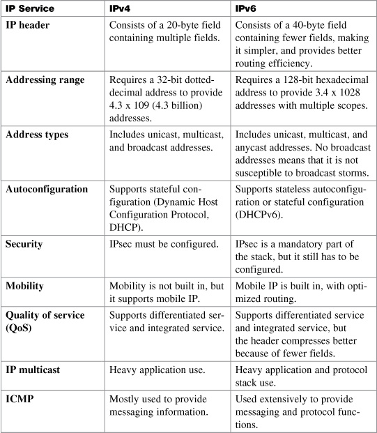

## What is IP?

An Internet Protocol address is also known as IP address. It is a numerical label which assigned to each device connected to a computer network which uses the IP for communication.

## IPv4
IPv4 was the first version of IP. It was deployed for production in the ARPANET in 1983. Today it is most widely used IP version. It is used to identify devices on a network using an addressing system.

1. The IPv4 uses a 32-bit address scheme allowing to store 2^32 addresses which is more than 4 billion addresses. 

2. Till date, it is considered the primary Internet Protocol and carries 94% of Internet traffic.

Features:

- Connectionless Protocol
- Allow creating a simple virtual communication layer over diversified devices
- It requires less memory, and ease of remembering addresses
- Already supported protocol by millions of devices
- Offers video libraries and conferences

## IPv6
It is the most recent version of the Internet Protocol. Internet Engineer Taskforce initiated it in early 1994. The design and development of that suite is now called IPv6.

1. This new IP address version is being deployed to fulfill the need for more Internet addresses. 
It was aimed to resolve issues which are associated with IPv4. 
With 128-bit address space, it allows 340 undecillion unique address space. 

2. IPv6 also called **IPng (Internet Protocol next generation)**.

Features:

- Hierarchical addressing and routing infrastructure
- Stateful and Stateless configuration
- Support for [quality of service (QoS)](https://docs.oracle.com/cd/E19683-01/817-0573/chapter1-25/index.html)
- An ideal protocol for [neighboring node interaction](https://docs.oracle.com/cd/E19683-01/817-0573/chapter1-40/index.html)

## IPv4 vs IPv6

General differences between IPv4 and IPv6 are as under:

