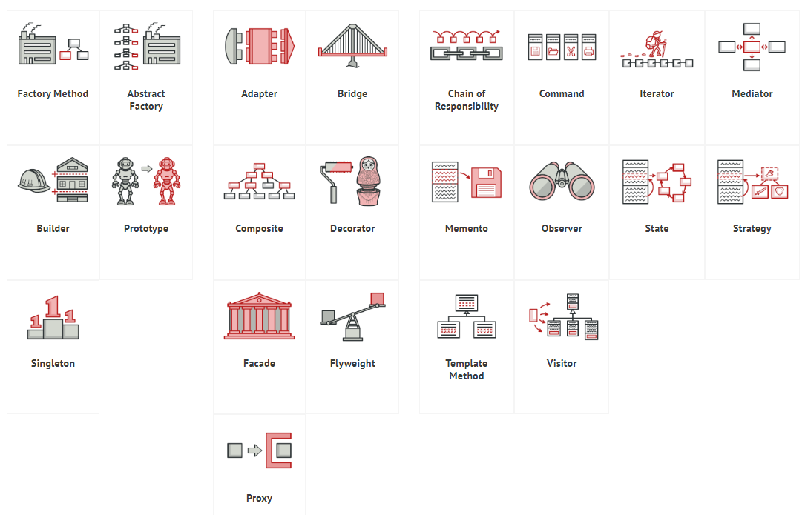
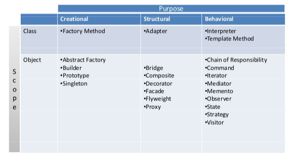

###### [Home](../../../README.md) > Design Pattern
> Design patterns are typical solutions to common problems
  in software design. Each pattern is like a blueprint
  that you can customize to solve a particular
  design problem in your code.

## Classification

## Creational Design Patterns
_Useful Acronym:_ **A**braham **B**ecame the **F**irst **P**resident of **S**tates.

#### Abstract Factory

###### Usage in Java Source Code
- `javax.xml.parsers.DocumentBuilderFactory#newInstance()`

- `javax.xml.transform.TransformerFactory#newInstance()`

- `javax.xml.xpath.XPathFactory#newInstance()`
    
###### Concept and code - References
 - [Tutorialspoint](https://www.tutorialspoint.com/design_pattern/abstract_factory_pattern.htm)
 - [Abstract Factory java example](https://refactoring.guru/design-patterns/abstract-factory/java/example)

###### Class diagram 

##### Builder

###### Usage in Java Source Code
- `java.lang.StringBuilder#append() (unsynchronized)`

- `java.lang.StringBuffer#append() (synchronized)`

- `java.nio.ByteBuffer#put() (also in CharBuffer, ShortBuffer, IntBuffer, LongBuffer, FloatBuffer and DoubleBuffer)`
    
###### Concept and code - References
 - [Tutorialspoint](https://www.tutorialspoint.com/design_pattern/builder_pattern.htm)
 - [Builder Pattern java example](https://refactoring.guru/design-patterns/builder/java/example)
 - [Builder Pattern: Think functional](https://medium.com/beingprofessional/think-functional-advanced-builder-pattern-using-lambda-284714b85ed5)

###### Class diagram 

##### Factory

###### Usage in Java Source Code
- `java.nio.charset.Charset#forName()`

- `java.net.URLStreamHandlerFactory#createURLStreamHandler(String)` (Returns different singleton objects, depending on a protocol)

- `java.util.EnumSet#of()`

- `javax.xml.bind.JAXBContext#createMarshaller()`

###### Concept and code - References
 - [Tutorialspoint](https://www.tutorialspoint.com/design_pattern/factory_pattern.htm)
 - [Factory Method Pattern java example](https://refactoring.guru/design-patterns/factory-method/java/example)
 - [Factory Pattern: The dynamic way using java 8](https://medium.com/@mhd.durrah/factory-pattern-the-dynamic-way-with-java-8-3ca5ab48a9cf)

###### Class diagram 

##### Prototype

> Prototype allows us to hide the complexity of making new instances from the client. The concept is to copy an existing object rather than creating a new instance from scratch, something that may include costly operations. The existing object acts as a prototype and contains the state of the object. The newly copied object may change same properties only if required. This approach saves costly resources and time, especially when the object creation is a heavy process. - _GeeksForGeeks_

###### Usage in Java Source Code
The Prototype pattern is available in Java out of the box with a `Cloneable` interface. Any class can implement this interface to become cloneable.

- `java.lang.Object#clone()` (class should implement the `java.lang.Cloneable` interface)

###### Concept and code - References
 - [Geeks For Geeks](https://www.geeksforgeeks.org/prototype-design-pattern/)
 - [Tutorialspoint](https://www.tutorialspoint.com/design_pattern/prototype_pattern.htm)
 - [Prototype Pattern java example](https://refactoring.guru/design-patterns/prototype/java/example)
 
###### Class diagram 

##### Singleton

###### Usage in Java Source Code
- `java.lang.Runtime#getRuntime()`

- `java.awt.Desktop#getDesktop()`

- `java.lang.System#getSecurityManager()`

###### Concept and code - References
 - [Tutorialspoint](https://www.tutorialspoint.com/design_pattern/singleton_pattern.htm)
 - [Singleton in Java - exhaustive details](https://medium.com/swlh/a-complete-guide-on-singleton-design-pattern-in-java-846c2f8df5fc)
 - [Singleton Pattern java example](https://refactoring.guru/design-patterns/singleton/java/example)
 
###### Class diagram 

## Structural Design Patterns
_Useful Acronym:_ A B C D 2F P

##### Adapter

###### Usage in Java Source Code
- `java.util.Arrays#asList()`

- `java.util.Collections#list()`

- `java.util.Collections#enumeration()`

- `java.io.InputStreamReader(InputStream) (returns a Reader object)`

- `java.io.OutputStreamWriter(OutputStream) (returns a Writer object)`

###### Concept and code - References
 - [Tutorialspoint](https://www.tutorialspoint.com/design_pattern/adapter_pattern.htm)
 - [Adapter Pattern in Java example](https://refactoring.guru/design-patterns/adapter/java/example)
  
###### Class diagram 

##### Bridge

###### Concept and code - References
 - [Tutorialspoint](https://www.tutorialspoint.com/design_pattern/bridge_pattern.htm)
 - [Bridge Design Pattern](https://refactoring.guru/design-patterns/bridge)
 - [Bridge Pattern in Java example](https://refactoring.guru/design-patterns/bridge/java/example)
  
###### Class diagram 

##### Composite

###### Usage in Java Source Code
- `java.awt.Container#add(Component)`

- `javax.faces.component.UIComponent#getChildren()`

###### Concept and code - References
 - [Tutorialspoint](https://www.tutorialspoint.com/design_pattern/composite_pattern.htm)
 - [Composite - Geeks For Geeks](https://www.geeksforgeeks.org/composite-design-pattern/)
 - [Composite Pattern in Java example](https://refactoring.guru/design-patterns/composite/java/example)

###### Class diagram 

##### Decorator

###### Usage in Java Source Code
- All subclasses of `java.io.InputStream, OutputStream, Reader and Writer` have constructors that accept objects of their own type.`

- `java.util.Collections`, methods `checkedXXX()`, `synchronizedXXX()` and `unmodifiableXXX()`.

- `javax.servlet.http.HttpServletRequestWrapper` and `HttpServletResponseWrapper`

###### Concept and code - References
 - [Tutorialspoint](https://www.tutorialspoint.com/design_pattern/decorator_pattern.htm)
 - [Decorator Pattern in Java example](https://refactoring.guru/design-patterns/decorator/java/example#lang-features)

###### Class diagram 

##### Facade

###### Usage in Java Source Code
- `javax.faces.context.FacesContext` uses `LifeCycle`, `ViewHandler`, `NavigationHandler` classes under the hood, but most clients aren’t aware of that.

###### Concept and code - References
 - [Tutorialspoint](https://www.tutorialspoint.com/design_pattern/facade_pattern.htm)
 - [Facade Pattern in Java example](https://refactoring.guru/design-patterns/facade/java/example)

###### Class diagram 

##### Flyweight

> The Flyweight pattern has a single purpose: minimizing memory intake. If your program doesn’t struggle with a shortage of RAM, then you might just ignore this pattern for a while.

###### Usage in Java Source Code
- `java.lang.Integer#valueOf(int)` (also `Boolean`, `Byte`, `Character`, `Short`, `Long` and `BigDecimal`)

###### Concept and code - References
 - [Tutorialspoint](https://www.tutorialspoint.com/design_pattern/flyweight_pattern.htm)
 - [Flyweight Pattern in Java example](https://refactoring.guru/design-patterns/flyweight/java/example)
 - [Flyweight Pattern and Counter Strike](https://www.geeksforgeeks.org/flyweight-design-pattern/)

###### Class diagram 

##### Proxy

###### Usage in Java Source Code
- `java.lang.Integer#valueOf(int)` (also `Boolean`, `Byte`, `Character`, `Short`, `Long` and `BigDecimal`)

###### Concept and code - References
 - [Tutorialspoint](https://www.tutorialspoint.com/design_pattern/proxy_pattern.htm)
 - [Proxy Pattern in Java example](https://refactoring.guru/design-patterns/proxy/java/example)
 
###### Class diagram 

## Behavioral Design Patterns
_Useful Acronym:_ 2MICS VOT

##### Mediator

###### Usage in Java Source Code
- `java.util.Timer` (all `scheduleXXX()` methods)

- `java.util.concurrent.Executor#execute()`

- `java.util.concurrent.ExecutorService` (`invokeXXX()` and `submit()` methods)

- `java.util.concurrent.ScheduledExecutorService` (all `scheduleXXX()` methods)

###### Concept and code - References
 - [Tutorialspoint](https://www.tutorialspoint.com/design_pattern/mediator_pattern.htm)
 - [Mediator Pattern in Java example](https://refactoring.guru/design-patterns/mediator/java/example)
 
###### Class diagram 

##### Memento

###### Usage in Java Source Code
- All `java.io.Serializable` implementations can simulate the Memento.

- All `javax.faces.component.StateHolder` implementations.

###### Concept and code - References
 - [Tutorialspoint](https://www.tutorialspoint.com/design_pattern/memento_pattern.htm)
 - [Memento Pattern in Java example](https://refactoring.guru/design-patterns/memento/java/example)
 
###### Class diagram 

##### Interpreter

> Interpreter pattern provides a way to evaluate language grammar or expression.

###### Concept and code - References
 - [Tutorialspoint](https://www.tutorialspoint.com/design_pattern/interpreter_pattern.htm)
 
###### Class diagram 

##### Iterator

###### Usage in Java Source Code

- `java.util.iterator`

- `java.util.Enumeration`

###### Concept and code - References
 - [Tutorialspoint](https://www.tutorialspoint.com/design_pattern/iterator_pattern.htm)
 - [Iterator Pattern in Java example](https://refactoring.guru/design-patterns/iterator/java/example)
 
###### Class diagram 

##### Chain of Responsibility

###### Usage in Java Source Code

- `javax.servlet.Filter#doFilter()`

- `java.util.logging.Logger#log()`

###### Concept and code - References
 - [Tutorialspoint](https://www.tutorialspoint.com/design_pattern/chain_of_responsibility_pattern.htm)
 - [Chain of responsibility Pattern in Java example](https://refactoring.guru/design-patterns/chain-of-responsibility/java/example)
 
###### Class diagram 

##### Command

###### Usage in Java Source Code

- All implementations of `java.lang.Runnable`
 
- All implementations of `javax.swing.Action`

###### Concept and code - References
 - [Tutorialspoint](https://www.tutorialspoint.com/design_pattern/command_pattern.htm)
 - [Command Pattern in Java](https://refactoring.guru/design-patterns/command/java/example#lang-features)
 
###### Class diagram 

##### State

###### Usage in Java Source Code

- `javax.faces.lifecycle.LifeCycle#execute()` (controlled by the `FacesServlet`: behaviour is dependent on current phase (state) of JSF lifecycle)

###### Concept and code - References
 - [Tutorialspoint](https://www.tutorialspoint.com/design_pattern/state_pattern.htm)
 - [State pattern in java](https://refactoring.guru/design-patterns/state/java/example)
 
###### Class diagram 

##### Strategy

###### Usage in Java Source Code

- `java.util.Comparator#compare()` called from `Collections#sort()`.

- `javax.servlet.http.HttpServlet`: service() method, plus all of the `doXXX()` methods that accept `HttpServletRequest` and `HttpServletResponse` objects as arguments.

- `javax.servlet.Filter#doFilter()`

###### Concept and code - References
 - [Tutorialspoint](https://www.tutorialspoint.com/design_pattern/strategy_pattern.htm)
 - [Strategy pattern in java](https://refactoring.guru/design-patterns/strategy/java/example)
 
###### Class diagram 

##### Visitor

###### Usage in Java Source Code

- `javax.lang.model.element.AnnotationValue` and `AnnotationValueVisitor`

- `javax.lang.model.element.Element` and `ElementVisitor`

- `javax.lang.model.type.TypeMirror` and `TypeVisitor`

- `java.nio.file.FileVisitor` and `SimpleFileVisitor`

###### Concept and code - References
 - [Tutorialspoint](https://www.tutorialspoint.com/design_pattern/visitor_pattern.htm)
 - [Visitor pattern in java](https://refactoring.guru/design-patterns/visitor/java/example)
 
###### Class diagram 

##### Observer

###### Usage in Java Source Code

- `java.util.Observer`/`java.util.Observable` (rarely used in real world)
- All implementations of `java.util.EventListener` (practically all over Swing components)
- `javax.servlet.http.HttpSessionBindingListener`
- `javax.servlet.http.HttpSessionAttributeListener`

###### Concept and code - References
 - [Tutorialspoint](https://www.tutorialspoint.com/design_pattern/observer_pattern.htm)
 - [Observer pattern in java](https://refactoring.guru/design-patterns/observer/java/example)
 
###### Class diagram 

##### Template

###### Usage in Java Source Code

- All non-abstract methods of `java.io.InputStream`, `java.io.OutputStream`, `java.io.Reader` and `java.io.Writer`.
- All non-abstract methods of `java.util.AbstractList`, `java.util.AbstractSet` and `java.util.AbstractMap`.
- `javax.servlet.http.HttpServlet`, all the `doXXX()` methods by default send a HTTP 405 “Method Not Allowed” error as a response. 

###### Concept and code - References
 - [Tutorialspoint](https://www.tutorialspoint.com/design_pattern/template_pattern.htm)
 - [Template pattern in java](https://refactoring.guru/design-patterns/template-method/java/example)
 
###### Class diagram 

## Books
- Head First Design Patterns

## Resources
- [Refactoring.guru](https://refactoring.guru/design-patterns)
- [Github repository with exhaustive design pattern implementation](https://github.com/iluwatar/java-design-patterns)
###### [Home](../../../README.md) > Design Pattern
