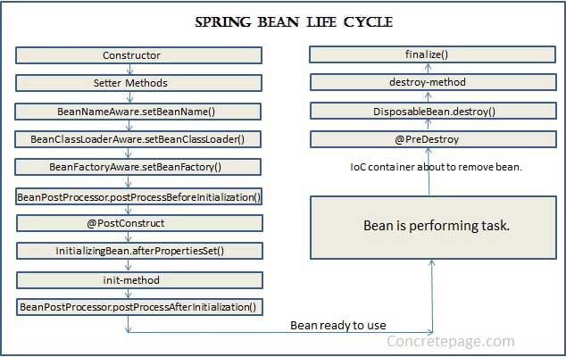

###### [Home](../../../../README.md) > Spring

## Why Spring?
The Spring Framework is an application framework and inversion of control container for the Java platform. 
The framework's core features can be used by any Java application, but there are extensions for building web applications 
on top of the Java EE (Enterprise Edition) platform. 

Although the framework does not impose any specific programming model, it has become popular in the Java community as an addition to, 
or even replacement for the Enterprise JavaBeans (EJB) model.

Refer: [https://spring.io/projects/spring-framework](https://spring.io/projects/spring-framework)

## Bean Life Cycle

###### [Home](../../../../README.md) > Spring
