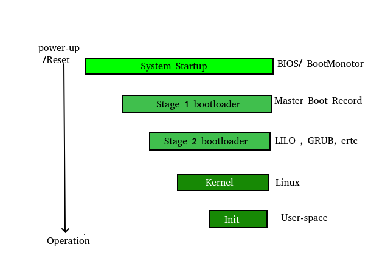

## System Bootstrap - Overview

## Detailed Steps
Following steps are performed behind the scene when we start the system:

### The Hardware powers on
When we press the power button, the computer supplies power to its components—the motherboard,
CPU, hard disks, solid state drives, graphics processors, and everything else in the computer.
The piece of hardware that supplies power is known as the **power supply**.

### The CPU loads BIOS or UEFI
Now that it has electricity, the CPU initializes itself and looks for a small program 
that is typically stored in a chip on the motherboard.

In the past, the PC loaded something called a **BIOS (Basic Input/Output System)**.
On modern PCs, the CPU loads **UEFI (Unified Extensible Firmware Interface)** firmware instead. 
This is a modern replacement for the old-style BIOS. 

Some PC manufacturers still call their UEFI software as BIOS.

### The UEFI or BIOS Tests and Initializes Hardware
The BIOS or UEFI firmware loads configuration settings from a special place on the
motherboard—traditionally, this was in memory backed up by a **CMOS battery**. 
*If you change some low-level settings in your BIOS or UEFI settings screen, 
this is where your custom settings are stored.*

The CPU runs the UEFI or BIOS, which tests and initializes your system’s hardware—including the CPU itself. 
For example, if your computer doesn’t have any RAM, it will beep and show you an error, stopping the boot process. 
This is known as the **POST (Power On Self Test)** process.

Responsibilities of BIOS during POST:
1. Verify CPU registers
2. Verify integrity of BIOS code itself
3. Verify basic components - DMA, timer, Interrupt controllers and others
4. Find, size and verify the main memory.
5. Initialize BIOS stored in *Electrically Erasable Programmable ROM (EEPROM)*
6. Identify, organize and select devices available for boot.

Possible errors:
1. **Fatal Error:** Due to hardware failure.
2. **Non-fatal Error:** Due to software failure.

**Beep** sound after POST indicates the result.
1. One short beep => system is ok.
2. Two short beeps => error.

### The UEFI or BIOS Hands Off to a Boot Device
*The UEFI or BIOS looks for a “boot device” to boot your operating system from.*
This is usually your computer’s hard disk or solid-state drive, 
but may also be a CD, DVD, USB drive, or network location. 
The boot device is configurable from within the UEFI or BIOS setup screen. 
If you have multiple boot devices, the UEFI or BIOS attempts to hand off the startup process 
to them in the order they’re listed. 
So, for example, if you have a bootable DVD in your optical drive, the system might try 
starting from that before it tries starting from your hard drive.

Traditionally, *a BIOS looked at the **MBR (master boot record)**, a special boot sector at the beginning of a disk.*
The MBR contains code that loads the rest of the operating system, known as a **bootloader**. 
The BIOS executes the bootloader, which takes it from there and begins booting the actual operating system—Windows or Linux, for example.

- MBR is a **512 byte** sector located in the first sector (/dev/hda) of the hard disk.
- MBR contains both program code and partition details.
- 512 bytes => 446 bytes of boot loader + 64 bytes of partition table + 2 bytes of magic number.
- **Magic Number (0xAA55)** is used for validation check of MBR.

### The Bootloader loads the full OS
The bootloader is a small program that has the large task of booting the rest of the operating system. 
*Windows uses a bootloader named **Windows Boot Manager** (Bootmgr.exe), most Linux systems use **GRUB (Grand Unified Bootloader)**, and Macs use something called **boot.efi**.*

If there’s a problem with the bootloader—for example, if its files are corrupted on disk—you’ll see a bootloader error message, and the boot process will stop.

**The bootloader is just one small program, and it doesn’t handle the boot process on its own**. 

On Windows:
1. the Windows Boot Manager finds and starts the Windows OS Loader. 

2. The OS loader loads essential hardware drivers that are required to run the kernel—the core part of the Windows operating system—and then launches the kernel. 

3. The kernel then loads the system Registry into memory and also loads any additional hardware drivers that are marked with **BOOT_START**, which means they should be loaded at boot. 
The Windows kernel then launches the **session manager process (Smss.exe)**, which starts the system session and loads additional drivers. 
This process continues, and Windows loads background services as well as the welcome screen, which lets you sign in.

On Linux, 

- GRUB is located in first sector of the bootable disk (/dev/hda)
- GRUB configuration is available at */boot/grub2/grub.cfg*
- Default Kernel information is available in the GRUB configuration file.

1. the GRUB boot loader loads the Linux kernel. 
   
   - An image file with basic root file system and all kernel modules is loaded into memory under /boot. 
   It is also called **initramfs (Initial RAM File System)**

2. The kernel also starts the **init system**—that’s systemd on most modern Linux distributions. 

    - /sbin/init program is executed i.e. Process ID 1.

3. The **init** system handles starting services and other user processes that lead all the way to a login prompt.

    - looks at /etc/inittab file to decide linux run level. Available run levels are:
      
      - 0 => halt
      - 1 => single user mode
      - 2 => multiuser without NFS
      - 3 => Full multi user (Preferred)
      - 4 => unused
      - 5 => X11
      - 6 => reboot
    
    - Depending on init level settings, system executes programs for corresponding rc directory
    i.e. /etc/rc.d/rc0.d or  /etc/rc.d/rc1.d.
       - If inside the directory file name starts with S => used during start
       - If inside the directory file name starts with K => used during kill.
       
    - System starts other daemons to support networking and other services.
    
    - x server daemon => GUI and login system

## References
1. [https://www.howtogeek.com/398493/what-exactly-happens-when-you-turn-on-your-computer/](https://www.howtogeek.com/398493/what-exactly-happens-when-you-turn-on-your-computer/)

2. [https://www.geeksforgeeks.org/what-happens-when-we-turn-on-computer/](https://www.geeksforgeeks.org/what-happens-when-we-turn-on-computer/)
